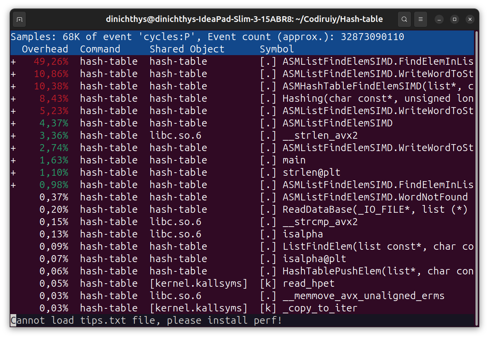
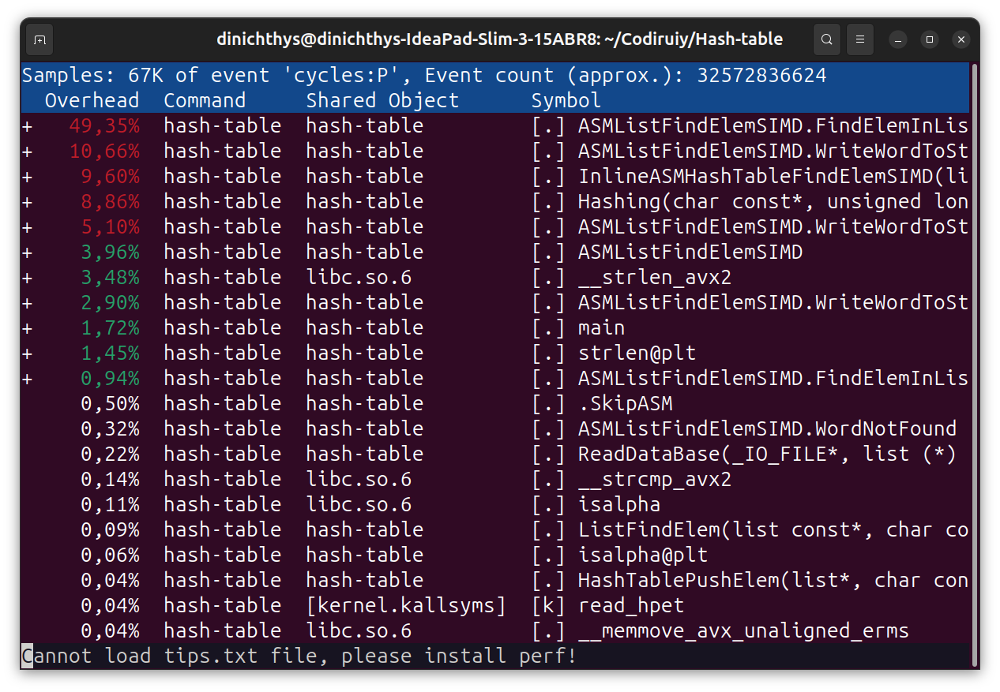
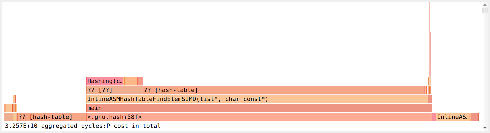

# Хеш-таблица

## Аннотация

### Цель работы

Реализовать структуру данных - хеш-таблицу с закрытой адресацией и разрешением конфликтов методом цепочек. После реализации требуется оптимизировать написанную программу тремя разными способами.

### Оборудование

<table>
    <thead>
        <tr>
            <th align="center" colspan = 2>Характеристики экспериментальной установки</th>
        </tr>
    </thead>
    <tbody>
        <tr>
            <td align="center">ОС</td>
            <td align="center">Ubuntu 24.04.2 LTS <p>
            Linux Kernel 6.11.0-21-generic</td>
        </tr>
        <tr>
            <td align="center">Процессор</td>
            <td align="center">AMD Ryzen 7 7730U with Radeon Graphics
            <p>
            16 ядер
            </td>
        </tr>
        <tr>
            <td align="center">Частота процессора на момент измерений</td>
            <td align="center">2 ГГц
            </td>
        </tr>
    </tbody>
</table>

Фиксирование частоты процессора происходило по средством команд:
``` bash
sudo cpupower frequency-set -u 2010Mhz
sudo cpupower frequency-set -d 1990Mhz
```
После завершения снятия измерений фиксация сбрасывалась командой:
``` bash
sudo cpupower frequency-set -g ondemand
```

## Теоретическая справка

### Структура Хеш-таблицы

Хеш таблица представляет из себя массив бакетов (списков), в которой при добавлении элемента индекс бакета, в который нужно его добавить, определялся по формуле

``Индекс бакета := Хеш элемента % Количество бакетов``

В бакетах же, которыми являются списки, хранятся слова и количество их добавлений.

### Оптимизации

Для анализа программы создавалась хеш-таблица на базе текста всех произведений из серии книг о Гарри Поттере.

## Ход работы

### Профилирование

Для определения горячих мест в программе был использован профилировщик `perf`, так как данный профилировщик поддерживается на аппаратном и системном уровнях.

Профиль создавался с помощью следующей команды:

``` bash
sudo perf record --call-graph dwarf ./build/hash-table
```

А просмотр профиля происходил с помощью `perf report`, который вызывался следующей командой:

``` bash
sudo perf report --no-children
```

Для построения графов использовался `hotspot`:

``` bash
sudo hotspot
```

Все вызовы происходили в режиме суперпользователя, чтобы в профиле имена системных функций были видны, а не замещались их адресами.

### Стартовая версия

#### Описание

Стартовая версия включала в себя составление таблицы из слов в виде строк (`char*`).

#### Результат профилирования

<table>
    <thead>
        <tr>
            <th align="center">Профиль</th>
            <th align="center">Граф</th>
        </tr>
    </thead>
    <tbody>
        <tr>
            <td align="center">
            
            </td>
            <td align="center">
            
            </td>
        </tr>
    </tbody>
</table>

### Первая оптимизация

#### Описание

В профиле первой программы можно увидеть, что самая горячая функция - `strcmp`.

Данный результат приводит нас к выводу о том, что нужно оптимизировать работу со строками. Сравнение строк можно сделать с помощью **SIMD** инструкций. Для этого их нужно будет загружать в широкие регистры, но их длина ограничена, поэтому для данной оптимизации ограничим длину допустимых слов. Будем считать, что количество слов длины большей **32** пренебрежимо мало. Тогда заменим работу со строками на **SIMD** интринсики.

#### Использование данной оптимизации на примере функции поиска элемента в списке:

<details>
<summary> Реализация функции до оптимизации на языке C </summary>

``` C
signed long long ListFindElem (const list_t* const list, const char* const element)
{
    ASSERT (list    != NULL, "Invalid pointer for list for ListFindElem\n");
    ASSERT (element != NULL, "Invalid pointer for element ListFindElem\n");

    LOG (kDebug, "Looking for \"%s\"\n", element);

    size_t list_elem_index = list->order[0].next;

    hash_elem_t* hash_elem_arr = (hash_elem_t*)(list->data);

    while (list_elem_index != 0)
    {
        if (strcmp (hash_elem_arr[list_elem_index].string, element) == 0)
        {
            LOG (kDebug, "Found \"%s\"\n", element);
            return (signed long long) list_elem_index;
        }
        list_elem_index = list->order[list_elem_index].next;
    }

    LOG (kDebug, "Didn't found \"%s\"\n", element);

    return kPoisonVal;
}
```
</details>

<details>
<summary> Реализация функции с использованием <b>SIMD</b> на языке C </summary>

``` C
signed long long ListFindElemSIMD (const list_t* const list, const char* const element)
{
    ASSERT (list    != NULL, "Invalid pointer for list for ListFindElem\n");
    ASSERT (element != NULL, "Invalid pointer for element ListFindElem\n");

    LOG (kDebug, "Looking for \"%s\"\n", element);

    char element_str [kMaxWordLen] = "";
    strcpy (element_str, element);

    __m256i element_SIMD = _mm256_load_si256 ((const __m256i*) element_str);

    size_t list_elem_index = list->order[0].next;

    hash_elem_t* hash_elem_arr = (hash_elem_t*)(list->data);

    __m256i cmp_elem = _mm256_setzero_si256 ();
    while (list_elem_index != 0)
    {
        cmp_elem = _mm256_load_si256 ((const __m256i*) hash_elem_arr[list_elem_index].string);
        if (_mm256_movemask_epi8 (_mm256_cmpeq_epi32 (element_SIMD, cmp_elem)) == 0xFF'FF'FF'FF)
        {
            LOG (kDebug, "Found \"%s\"\n", element);
            return (signed long long) list_elem_index;
        }
        list_elem_index = list->order[list_elem_index].next;
    }

    LOG (kDebug, "Didn't found \"%s\"\n", element);

    return kPoisonVal;
}
```

</details>

#### Результат профилирования

<table>
    <thead>
        <tr>
            <th align="center">Профиль</th>
            <th align="center">Граф</th>
        </tr>
    </thead>
    <tbody>
        <tr>
            <td align="center">
            
            </td>
            <td align="center">
            
            </td>
        </tr>
    </tbody>
</table>

#### Результат оптимизации

<table>
    <thead>
        <tr>
            <th align="center">Относительно чего измеряется прирост производительности</th>
            <th align="center">Во сколько раз ускорилась программа</th>
        </tr>
    </thead>
    <tbody>
        <tr>
            <td align="center">
            Стартовая версия
            </td>
            <td align="center">
            1.79
            </td>
        </tr>
    </tbody>
</table>

### Вторая оптимизация

#### Описание

Полученный профиль показывает, что теперь горячей стала функция поиска элемента в списке. Данная функция написана содержит в себе лишь один цикл с поиском элемента и больше ничего, что означает, что оптимизация данной функции возможна лишь в случае переписывания её на язык **ассемблера**. Такое могло случиться, если компилятор не смог учесть все задержки по времени на работу с памятью и не достаточно хорошо распределил инструкции.

При переводе на язык ассемблера данной функции нужно было учесть, что загрузка из памяти **256** бит информации - долгий процесс, поэтому простой перевод данной функции нам бы не сильно помог. Для лучшего результата сделаем так:

1. Заранее поставим на загрузку слово в регистр **ymm2** (ещё до цикла)
2. Как только понадобиться это слово, переложим его из **ymm2** в **ymm1**
3. Сразу после этого (до сравнения **ymm1** с искомым словом) поставим следующее в списке слово на загрузку в **ymm2**.

Таким образом, загрузка слова в широкий регистр **ymm2** всегда будет происходить параллельно с другими операциями, а в случае необходимости сравнения закаченного слова с искомым, значение из одного широкого регистра **ymm2** будет перекладываться в другой широкий регистр **ymm1**, что быстрее, чем доступ в память.

<details>
<summary> Реализация функции на языке <b>Assembly</b> (<i>NASM x86-64</i>) </summary>

``` asm
ASMListFindElemSIMD:
    push rbp
    mov rbp, rsp

    mov rax, rsp
    and rax, kMaskAlign
    add rsp, rax
    sub rsp, kAlignment

    push kEndSym
    push kEndSym
    push kEndSym
    push kEndSym                            ; Place in stack for buffer

    mov rcx, kWordLen

.WriteWordToStack_Comparison:
    cmp byte [rsi], kEndSym
    je .WriteWordToStack_Stop

    test rcx, rcx
    je .WriteWordToStack_Error

.WriteWordToStack_Body:
    mov al, byte [rsi]
    mov byte [rsp], al
    inc rsp
    inc rsi
    dec rcx
    jmp .WriteWordToStack_Comparison
.WriteWordToStack_Stop:                    ; The word was written to the stack

    mov rsi, rcx
    mov rcx, kWordLen
    sub rcx, rsi
    sub rsp, rcx                           ; Set RSP on the start of the word

    vmovaps ymm0, yword [rsp]              ; YMM0 = The word
    mov rcx, qword [rdi + 2*kSizePointer]  ; RCX = number of list elements
    mov rdi, qword [rdi]                   ; RDI = array of data
    mov rdx, 1

    mov r9, rdi
    add r9, 2 * kWordLen                   ; R9 = Current word

    inc rcx
    vmovaps ymm2, yword [r9]

.FindElemInList_Comparison:

    cmp rdx, rcx                          ; RDX = Null element
    jae .WordNotFound

    inc rdx

    vmovaps ymm1, ymm2
    add r9, 2 * kWordLen                  ; R9 = Current word

    vmovaps ymm2, yword [r9]
    vpxor ymm3, ymm1, ymm0                ; Comparison
    vptest ymm3, ymm3                     ; Check that ymm2 == 0

    jne .FindElemInList_Comparison

.FindElemInList_Stop:
    mov rsp, rbp
    pop rbp
    mov rax, rdx
    mov rdi, rdx
    ret

.WordNotFound:
    mov rsp, rbp
    pop rbp
    mov rax, kPoison
    mov rdi, rax
    ret

.WriteWordToStack_Error:
    mov rsp, rbp
    pop rbp
    mov rax, kTooLongWordError
    mov rdi, rax
    ret
```

</details>

#### Результат профилирования

<table>
    <thead>
        <tr>
            <th align="center">Профиль</th>
            <th align="center">Граф</th>
        </tr>
    </thead>
    <tbody>
        <tr>
            <td align="center">
            
            </td>
            <td align="center">
            
            </td>
        </tr>
    </tbody>
</table>

#### Результат оптимизации

<table>
    <thead>
        <tr>
            <th align="center">Относительно чего измеряется прирост производительности</th>
            <th align="center">Во сколько раз ускорилась программа</th>
        </tr>
    </thead>
    <tbody>
        <tr>
            <td align="center">
            Стартовая версия
            </td>
            <td align="center">
            2.97
            </td>
        </tr>
        <tr>
            <td align="center">
            Предыдущая версия
            </td>
            <td align="center">
            1.66
            </td>
        </tr>
    </tbody>
</table>

### Третья оптимизация

#### Описание

Полученный после предыдущей оптимизации профиль показывает, что функция не перестала быть горячей, но дальнейшая её оптимизация невозможна, так как функция уже написана в самой быстрой своей версии. В таком случае, оптимизировать нужно следующую горячую функцию - функцию поиска элемента в хеш-таблице.

<details>
<summary> Как выглядит функция, которую нужно оптимизировать? </summary>

``` C
signed long long ASMHashTableFindElemSIMD (hash_table_t hash_table, const char* const element)
{
    ASSERT (hash_table != NULL, "Invalid pointer for hash table for HashTableFindElem\n");
    ASSERT (element    != NULL, "Invalid pointer for element HashTableFindElem\n");

    const size_t bucket_index = Hashing (element, strlen (element)) % kNumBucket;

    const signed long long val_index =
    ASMListFindElemSIMD (&hash_table [bucket_index], element);

    if (val_index == kPoisonVal)
    {
        return kPoisonVal;
    }

    return (signed long long) ((hash_elem_t*)(hash_table [bucket_index].data))[val_index].counter;
}
```

</details>

В данной функции происходит лишь расчёт хеша элемента, а затем поиск этого элемента в выбранном списке. Однако, можно заметить, что возвращаемое значение этой функции содержит несколько доступов в память, а значит, эту часть функции и нужно улучшить.

Частично функцию можно оптимизировать с помощью **inline assembly**. Им и воспользуемся.

Заметим, что в данном выражении происходит доступ к счётчику количества добавления слов в таблицу. Вспомним, что перед этим мы вызывали функцию поиска слова в списке, написанную на языке ассемблера, то есть мы знаем, как в ней между регистрами будут распределены данные. В таком случае запишем на выходе из функции поиска элемента в списке её результат - **RAX** - в регистр **RDI**, а в начале ассемблерной вставки вернём его в **RAX**. Сравним значение **RAX** с **-1** (ядовитое значение), и в случае равенства выйдем из функции.

В противном случае вспомним, что в **R9** лежал указатель на элемент, следующий за найденным, то есть счётчик в найденном элементе должен лежать по адресу **R9** - 32, так как структура была увеличена до 32 байт с целью выравнивания данных по 32 с целью работы с **SIMD** интринсиками. Таким образом, положим эту величину в **ret_val** и выйдем из функции.

<details>
<summary> Реализация функции с помощью <b>asm ()</b> </summary>

``` C
signed long long InlineASMHashTableFindElemSIMD (hash_table_t hash_table, const char* const element)
{
    ASSERT (hash_table != NULL, "Invalid pointer for hash table for HashTableFindElem\n");
    ASSERT (element    != NULL, "Invalid pointer for element HashTableFindElem\n");

    signed long long ret_val = kPoisonVal;
    const size_t bucket_index = Hashing (element, strlen (element)) % kNumBucket;

    ASMListFindElemSIMD (&hash_table [bucket_index], element);

    asm(
        "movq %%rdi, %%rax\n\t"                         // Возвращаем значение после выхода из функции поиска элемента в списке
        "cmpq %1, %%rax\n\t"                            // Сравнение с kPoisonVal
        "je .SkipASM\n\t"

        "subq $32, %%r9\n\t"
        "movq (%%r9), %0\n\t"                        // R9 = указатель на counter в hash_elem_t

        ".SkipASM:\n\t"
        : "=r" (ret_val)
        : "r" (kPoisonVal)
        :
    );

    return ret_val;
}
```

</details>

#### Результат профилирования

<table>
    <thead>
        <tr>
            <th align="center">Профиль</th>
            <th align="center">Граф</th>
        </tr>
    </thead>
    <tbody>
        <tr>
            <td align="center">
            
            </td>
            <td align="center">
            
            </td>
        </tr>
    </tbody>
</table>

#### Результат оптимизации

<table>
    <thead>
        <tr>
            <th align="center">Относительно чего измеряется прирост производительности</th>
            <th align="center">Во сколько раз ускорилась программа</th>
        </tr>
    </thead>
    <tbody>
        <tr>
            <td align="center">
            Стартовая версия
            </td>
            <td align="center">
            3.016
            </td>
        </tr>
        <tr>
            <td align="center">
            Предыдущая версия
            </td>
            <td align="center">
            1.016
            </td>
        </tr>
    </tbody>
</table>

### Достаточно ли оптимизаций?

Последняя оптимизация принесла прирост в 1 процент относительно предыдущей версии, что означает, что на этом пора заканчивать, так как выгода от последующий оптимизаций не будет стоить потраченного времени.

## Выводы

В данной работе мы смогли применить три вида оптимизаций программы -

1. Использование **SIMD** интринсиков для работы со строками
2. Переписывание функции на язык ассемблера с целью оптимального распределения инструкций с учётом времени доступа в память
3. Использование ассемблерной вставки с учётом распределения данных по регистрам.

Суммарно все эти три оптимизации дали ускорение программы в 3 раза, что довольно много, если масштабировать нашу задачу.
